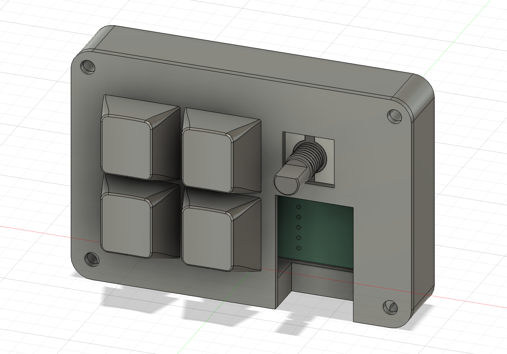
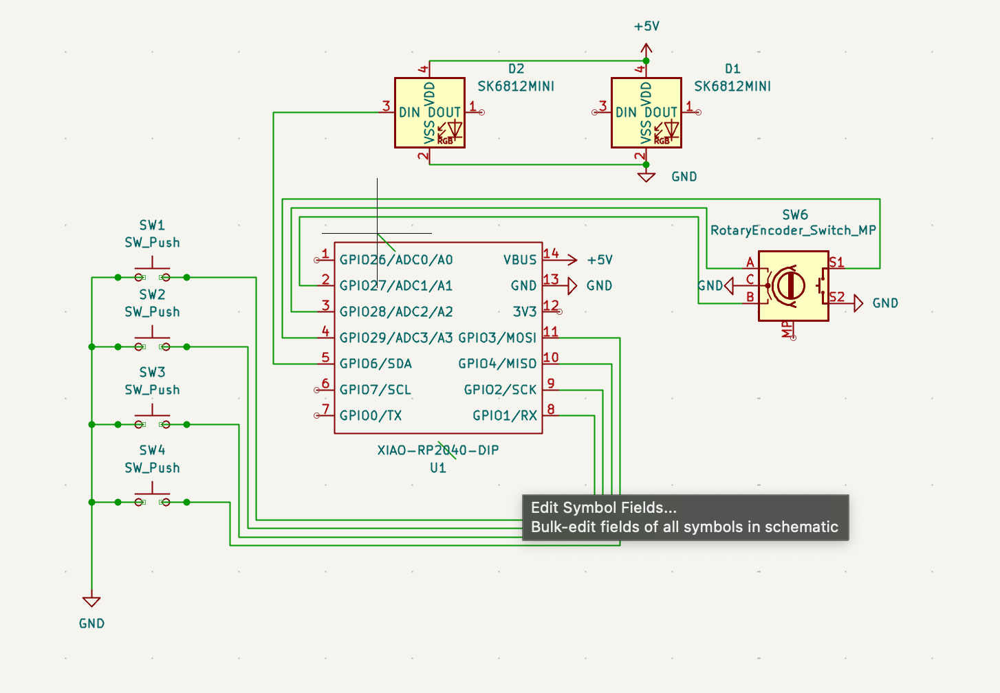
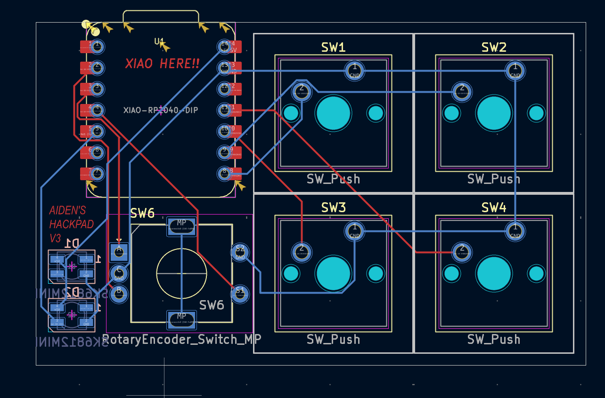

# AIDEN C's HackPad!

## Features

- 4 Switches all with macros (vscode shortcuts mainly)
- 2 LEDs
- Volume knob that controls volume (i think)

## CAD

## PCB

| **Schematic**              | **PCB**             |
| -------------------------- | ------------------- |
|  |  |

## Firmware

volume knob and macros for vscode (open terminal, and command palette)

## [Bill of materials]()

- 1x 3d Printed Case
- 1x Seeed XIAO RP2040
- 1x EC11 Rotary Encoder
- 4x Cherry MX Switches
- 4x Blank DSA Keycaps
- 2x SK6812 MINI-E LEDs
- 4x M3x16mm screws
- 4x M3x5mx4mm heatset inserts
